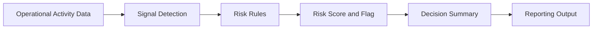

# Operational Risk & Decision Intelligence System

A documentation-first operational risk and decision-support prototype that turns routine activity signals into explainable risk flags, risk scores, and review-ready summaries.

The project demonstrates how operational data can be organized into a transparent review framework that helps teams identify early warning signs before they become larger delivery, quality, or accountability problems.

## Project Summary

Operational teams generate activity data through tickets, cases, handoffs, status changes, due dates, and rework. The challenge is not simply collecting that data. It is deciding which signals deserve attention and explaining why.

This Phase 1 prototype defines a deterministic approach to operational risk review. It uses documented business rules rather than predictive or black-box models, allowing each result to be traced back to the signals that produced it.

## Problem It Solves

Operational issues often develop gradually across disconnected workflows. A single overdue task may not be concerning, but an overdue, high-priority item with repeated handoffs and rework may require immediate review.

The framework is designed to help teams:

- Convert routine operational activity into consistent risk indicators
- Focus review time on items with stronger warning signals
- Explain why an item was classified as stable, watch, or at risk
- Support escalation and process-improvement conversations
- Preserve traceability between inputs, rules, and outputs

## Why It Matters

Operational risk can remain hidden when teams rely only on status labels, backlog totals, or manual review. Combining several activity signals provides a clearer view of potential process friction, unclear ownership, delivery delay, and quality risk.

This project focuses on practical visibility rather than prediction. Its purpose is to make emerging risk easier to identify, communicate, and review.

## What It Does

The current prototype documents:

- Operational signals used for risk review
- A deterministic risk-scoring model
- Stable, watch, and at-risk thresholds
- Explainable reasons for each classification
- A reporting flow for review-ready summaries
- Governance assumptions, limitations, and failure modes
- Separation of raw and validated data for traceability

## How It Works



1. Operational activity data is collected and validated.
2. Relevant signals are identified, including overdue days, priority, handoffs, and rework.
3. Deterministic rules convert those signals into a risk score.
4. Thresholds classify each item as stable, watch, or at risk.
5. The result is summarized with an explanation for human review.

## Risk Scoring Logic

The documented scoring model is:

```text
Risk Score =
(Overdue Days x 0.4)
+ (Number of Handoffs x 0.3)
+ (Priority Weight x 0.2)
+ (Rework Count x 0.1)
```

The current review thresholds are:

| Score | Classification | Review Meaning |
| ---: | --- | --- |
| 0-30 | Stable | No immediate risk signal based on the current rules |
| 31-60 | Watch | Review is recommended |
| 61+ | At Risk | Escalation or closer follow-up may be needed |

The weights and thresholds are illustrative. They would need to be calibrated to the operating context and available data before real-world use.

See [logic/risk_scoring.md](logic/risk_scoring.md) for the detailed model and intended-use guidance.

## Example Walkthrough

The following example shows how three operational items could be evaluated during a weekly review.

### Sample Operational Input

| Item ID | Status | Priority Weight | Overdue Days | Handoff Count | Rework Count |
| --- | --- | ---: | ---: | ---: | ---: |
| OPS-1042 | In Review | 50 | 120 | 8 | 6 |
| OPS-1087 | Open | 50 | 60 | 8 | 8 |
| OPS-1110 | In Progress | 20 | 20 | 1 | 0 |

### Example Risk Output

| Item ID | Risk Score | Flag | Explanation | Suggested Review |
| --- | ---: | --- | --- | --- |
| OPS-1042 | 61 | At Risk | Significantly overdue with elevated priority, multiple handoffs, and rework | Confirm ownership, identify the blocker, and determine whether escalation is needed |
| OPS-1087 | 37 | Watch | Moderate overdue, handoff, and rework signals | Confirm ownership and monitor during the next review |
| OPS-1110 | 12 | Stable | Current signals do not indicate immediate review risk | Continue normal tracking |

### Why OPS-1042 Was Flagged

OPS-1042 crosses the at-risk threshold because several operational signals are present together. The item is significantly overdue, has elevated priority, has moved through multiple handoffs, and includes rework.

The flag does not mean the item has failed, and it does not trigger an automatic action. It indicates that the item should receive human review before the underlying issue becomes more difficult to resolve.

## Repository Structure

```text
.
+-- analysis/      # Analysis scope, summaries, trends, and calibration concepts
+-- data/          # Raw and validated data organization
+-- governance/    # Assumptions, limitations, exclusions, and failure modes
+-- logic/         # Deterministic risk-scoring model
+-- reporting/     # Review summaries and decision-brief concepts
+-- README.md      # Public project overview
```

## Tech Stack

This is a documentation-first prototype. The repository currently uses:

- Markdown for project, governance, and reporting documentation
- Mermaid for the process architecture
- Deterministic business rules for risk scoring
- Structured tables for example inputs and outputs

## Design Principles

- Clarity over complexity
- Explainable rules over black-box scoring
- Human review before escalation
- Traceability from input signals to output classifications
- Explicit assumptions and limitations
- Practical reporting for operational and leadership review

## Business Technology Relevance

The project demonstrates transferable skills across business technology, operations, analytics, risk, and process-improvement roles:

- Operations analysis
- Risk tracking
- Business-rule documentation
- Process improvement
- Workflow visibility
- Reporting and decision summaries
- Data-driven escalation
- Stakeholder communication
- Governance-aware system design

## What I Learned

This project reinforced that operational risk scoring is not only a technical exercise. A useful framework also requires understandable assumptions, defensible rules, explainable outputs, and clear guidance on how results should and should not be used.

It also demonstrated the value of translating operational activity into a concise review format that supports discussion without replacing human judgment.

## Future Improvements

- Add a small, non-sensitive sample dataset
- Implement the scoring model in a spreadsheet or notebook
- Produce reusable weekly risk-summary outputs
- Add threshold-calibration examples
- Create a simple dashboard-style reporting view
- Document sample escalation and exception-review workflows

## Status

This repository represents a Phase 1, documentation-first prototype.

It is not deployed, production-ready, or connected to live operational systems. The scores and classifications are illustrative and are intended to support human review, not automatic decisions.
