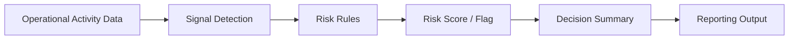

# Operational Risk & Decision Intelligence System

A deterministic decision-support prototype for turning routine operational activity signals into explainable risk flags, risk scores, and decision-ready summaries.

This project is designed to help teams notice early warning signs, such as overdue work, repeated handoffs, high-priority backlog, and rework, before they become larger operational problems.

## Project Summary

Operational teams often track work across tickets, handoffs, priorities, reviews, and status updates. The challenge is not always a lack of data. The harder problem is knowing which activity signals deserve attention before an issue becomes expensive, visible, or difficult to recover from.

This repository documents a Phase 1 framework for operational risk review. It uses transparent rules instead of black-box prediction so that every score and flag can be explained, challenged, and adjusted.

## Problem It Solves

Teams can miss early warning signs when operational work is spread across many systems or reviewed only after problems become obvious.

This project addresses that gap by showing how a team could:

- Convert operational activity into structured risk indicators
- Flag items that may need review or escalation
- Explain why an item was flagged
- Summarize risk in a format that supports management review
- Preserve assumptions, limitations, and traceability

## Why This Matters

In operations, risk often builds gradually. An item that is overdue, high priority, reopened, and passed between multiple owners may look like just another task in a queue. In context, those signals can point to process friction, unclear accountability, quality issues, or escalation risk.

This prototype focuses on practical decision support: making risk easier to see, explain, and discuss.

## What It Does

Based on the current repository files, this project defines:

- A documented scoring model for operational risk
- Risk factors such as overdue days, ownership handoffs, priority, and rework count
- Thresholds for stable, watch, and at-risk items
- A governance-first approach with limitations and failure modes documented
- A reporting concept focused on decision briefs and leadership review
- A data structure concept that separates raw and validated data for traceability

## Example Use Case

A team lead reviews weekly operational activity and wants to know which items need attention before the next leadership meeting.

Instead of reviewing every item manually, the system helps identify work that has risk signals such as:

- The item is overdue
- The item has moved between several owners
- The item is high priority
- The item has been reopened or reworked

The output is not an automatic decision. It is a clearer starting point for review, escalation, and process improvement conversations.

## How It Works



1. Operational activity data is separated into raw and validated data sources.
2. Relevant signals are identified, such as overdue days, handoffs, priority, and rework count.
3. Deterministic rules convert those signals into a risk score.
4. Thresholds classify items as stable, watch, or at risk.
5. The result is summarized for review and escalation discussions.

## Data Inputs

The repository currently documents the expected data organization and scoring framework rather than providing a live dataset.

Example operational fields:

| Field | Purpose |
| --- | --- |
| Item ID | Unique operational item or case reference |
| Status | Current state of the item |
| Priority | Business urgency or severity |
| Due Date | Used to calculate overdue days |
| Owner / Team | Used to track accountability and handoffs |
| Handoff Count | Number of ownership or team transfers |
| Rework Count | Number of reopenings, corrections, or repeat work cycles |

## Risk Logic / Decision Rules

The documented scoring model is:

```text
Risk Score =
(Overdue Days x 0.4)
+ (Number of Handoffs x 0.3)
+ (Priority Weight x 0.2)
+ (Rework Count x 0.1)
```

Current thresholds:

| Score Range | Label | Meaning |
| --- | --- | --- |
| 0-30 | Stable | No immediate risk signal based on current rules |
| 31-60 | Watch | Review recommended |
| 61+ | At Risk | Escalation or closer follow-up may be needed |

The score is designed to support human review. It is not intended to automate decisions, rank employee performance, or replace management judgment.

See [logic/risk_scoring.md](logic/risk_scoring.md) for the detailed scoring notes.

## Example Walkthrough

The example below shows how the framework could evaluate a small set of operational items during a weekly review.

### Sample Operational Input

| Item ID | Status | Priority Weight | Overdue Days | Handoff Count | Rework Count |
| --- | --- | ---: | ---: | ---: | ---: |
| OPS-1042 | In Review | 50 | 120 | 8 | 6 |
| OPS-1087 | Open | 50 | 60 | 8 | 8 |
| OPS-1110 | In Progress | 20 | 20 | 1 | 0 |

### Calculated Risk Output

| Item ID | Risk Score | Flag | Explanation | Suggested Review |
| --- | ---: | --- | --- | --- |
| OPS-1042 | 61 | At Risk | High-priority item is significantly overdue, has multiple handoffs, and includes rework | Confirm current owner, identify blocker, and decide whether escalation is needed |
| OPS-1087 | 37 | Watch | Item has moderate overdue, handoff, and rework signals | Monitor in the next weekly review and confirm ownership |
| OPS-1110 | 12 | Stable | Current signals do not indicate immediate review risk | Continue normal tracking |

### Why OPS-1042 Was Flagged

OPS-1042 was flagged because several operational signals are present at the same time. The item is overdue, high priority, has moved through multiple handoffs, and has a rework signal. Any one of those signals might be manageable on its own, but together they suggest a higher chance of delay, unclear accountability, or process friction.

The flag does not mean the item has failed. It means the item should be reviewed before it becomes a larger operational issue.

## Repository Structure

```text
.
+-- analysis/      # Planned summaries, trend analysis, and threshold calibration notes
+-- data/          # Raw and validated data organization concept
+-- governance/    # Assumptions, limitations, exclusions, and failure modes
+-- logic/         # Deterministic risk scoring model
+-- reporting/     # Decision brief and reporting concepts
+-- README.md      # Public project overview
```

## Tech Stack

This repository is currently documentation-first. The current files use:

- Markdown
- Mermaid diagrams
- Deterministic scoring logic
- Governance and reporting documentation

## Design Principles

- Clarity over complexity
- Explainable rules over black-box scoring
- Human review before escalation
- Traceability between inputs, rules, outputs, and limitations
- Practical reporting for operations and leadership conversations

## Business Technology Relevance

This project connects to business technology and operations roles because it demonstrates:

- Operations analysis
- Risk tracking
- Process improvement
- Reporting and decision summaries
- Business rules documentation
- Data-driven escalation
- Stakeholder communication
- Workflow visibility
- Governance-aware system thinking

## What I Learned

This project helped me practice translating an operations problem into a structured decision-support model. The main learning was that risk scoring is not only a technical exercise. It also requires clear assumptions, careful thresholds, explainable outputs, and an understanding of how people will use the results in review meetings.

## Future Improvements

- Add a small sample dataset for demonstration
- Create example risk summary outputs
- Add spreadsheet or notebook-based scoring examples
- Build a simple dashboard-style report
- Add calibration notes showing how thresholds could be tuned over time
- Document example escalation workflows

## Status

Phase 1 prototype/framework. The repository currently documents the operating model, risk logic, reporting intent, and governance limitations.

This project is not deployed, production-ready, or connected to live operational systems. It is designed to support human review, not automated decisions.
