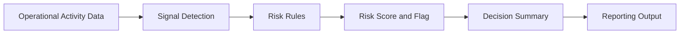

# Operational Risk & Decision Intelligence System

An operational risk and decision-support framework that turns routine operational signals into explainable risk scores, flags, and review-ready summaries.

The project shows how activity data from workflows, tickets, cases, and handoffs can be organized into a practical review framework for spotting early signs of operational risk.

## Project Summary

Operational teams generate activity data through tickets, cases, handoffs, status changes, due dates, and rework. The challenge is turning that activity into clear signals that help teams decide what needs review.

This Phase 1 framework defines a rule-based approach to operational risk review. Each classification can be traced back to the signals and scoring logic that produced it.

## Problem It Solves

Operational issues often develop gradually across disconnected workflows. A single overdue task may not be concerning, but an overdue, high-priority item with repeated handoffs and rework may deserve closer attention.

The framework is designed to help teams:

- Convert routine operational activity into consistent risk indicators
- Focus review time on items with stronger warning signals
- Explain why an item was classified as stable, watch, or at risk
- Support escalation and process-improvement conversations
- Preserve traceability between inputs, rules, and outputs

## Why It Matters

Operational risk can remain hidden when teams rely only on status labels, backlog totals, or manual review. Combining several activity signals provides a clearer view of potential process friction, unclear ownership, delivery delay, and quality risk.

This project focuses on practical visibility rather than prediction. Its purpose is to make emerging risk easier to identify, communicate, and review before small problems grow into larger process issues.

## What It Does

The current framework documents:

- Operational signals used for risk review
- A documented risk-scoring model
- Stable, watch, and at-risk thresholds
- Explainable reasons for each classification
- A reporting flow for review-ready summaries
- Governance assumptions, limitations, and failure modes
- Separation of raw and validated data for traceability

## How It Works



1. Operational activity data is collected and organized.
2. Relevant signals are identified, including overdue days, priority, handoffs, and rework.
3. Business rules convert those signals into a risk score.
4. Thresholds classify each item as stable, watch, or at risk.
5. The result is summarized with an explanation for review.

## Risk Scoring Logic

The documented scoring model is:

```text
Risk Score =
(Overdue Days x 0.4)
+ (Number of Handoffs x 0.3)
+ (Priority Weight x 0.2)
+ (Rework Count x 0.1)
```

The current review thresholds are:

| Score | Classification | Review Meaning |
| ---: | --- | --- |
| 0-30 | Stable | No immediate risk signal based on the current rules |
| 31-60 | Watch | Review is recommended |
| 61+ | At Risk | Escalation or closer follow-up may be needed |

The weights and thresholds are examples for Phase 1. They would need to be calibrated to the operating context and available data before real-world use.

See [logic/risk_scoring.md](logic/risk_scoring.md) for the detailed model and intended-use guidance.

## Example Walkthrough

The following example shows how three operational items could be evaluated during a weekly review.

### Sample Operational Input

| Item ID | Status | Priority Weight | Overdue Days | Handoff Count | Rework Count |
| --- | --- | ---: | ---: | ---: | ---: |
| OPS-1042 | In Review | 50 | 120 | 8 | 6 |
| OPS-1087 | Open | 50 | 60 | 8 | 8 |
| OPS-1110 | In Progress | 20 | 20 | 1 | 0 |

### Example Risk Output

| Item ID | Risk Score | Flag | Explanation | Suggested Review |
| --- | ---: | --- | --- | --- |
| OPS-1042 | 61 | At Risk | Significantly overdue with elevated priority, multiple handoffs, and rework | Confirm ownership, identify the blocker, and determine whether escalation is needed |
| OPS-1087 | 37 | Watch | Moderate overdue, handoff, and rework signals | Confirm ownership and monitor during the next review |
| OPS-1110 | 12 | Stable | Current signals do not indicate immediate review risk | Continue normal tracking |

### Why OPS-1042 Was Flagged

OPS-1042 crosses the at-risk threshold because several operational signals are present together. The item is significantly overdue, has elevated priority, has moved through multiple handoffs, and includes rework.

The flag does not mean the item has failed. It indicates that the item should receive review before the underlying issue becomes more difficult to resolve.

## Repository Structure

```text
.
+-- analysis/      # Analysis scope, summaries, trends, and calibration concepts
+-- data/          # Raw and validated data organization
+-- governance/    # Assumptions, limitations, exclusions, and failure modes
+-- logic/         # Deterministic risk-scoring model
+-- reporting/     # Review summaries and decision-brief concepts
+-- README.md      # Public project overview
```

## Tech Stack

- Markdown for project and governance documentation
- Mermaid for the process architecture
- Deterministic business rules for risk scoring
- Structured operational data and reporting examples

## Design Approach

The framework prioritizes explainable risk signals, traceable scoring logic, and human review. Each classification can be traced back to the operational signals and rules that produced it.

## Next Phase

The next phase will implement the scoring model using sample operational data and expand the reporting layer with reusable risk summaries and a dashboard-style review view.

## Current Status

The core risk framework, scoring logic, governance structure, and reporting flow are complete for Phase 1.
