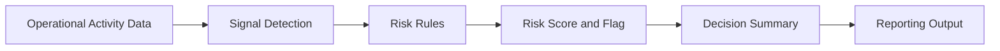

# Operational Risk & Decision Intelligence System

An operational risk and decision-support framework that turns routine activity signals into explainable risk scores, flags, and review-ready summaries.

Operational teams already generate signals through overdue work, priority levels, repeated handoffs, and rework. Those signals are often reviewed separately, making patterns of emerging risk harder to identify before they affect delivery, quality, or ownership.

## Operational Problem

Status labels and backlog counts rarely tell the full story. A single overdue item may be manageable, but an overdue high-priority item with multiple handoffs and rework can point to a deeper process issue.

The review model brings those signals together so operational risk can be evaluated consistently and discussed with clear supporting context.

## Review Framework

| Layer | Includes | Output |
| --- | --- | --- |
| Inputs | Overdue days, priority weight, handoff count, rework count | Structured operational signals |
| Processing | Defined risk rules, weighted scoring, classification thresholds | Risk score and stable/watch/at-risk flag |
| Review output | Explanation and suggested review action | Summary for operational or leadership review |

## How It Works


```mermaid
graph LR;
    A[Operational Activity Data] --> B[Signal Detection];
    B --> C[Risk Rules];
    C --> D[Risk Score and Flag];
    D --> E[Decision Summary];
    E --> F[Reporting Output];
```

1. Operational activity data is organized for review.
2. Overdue days, priority, handoffs, and rework are identified as review signals.
3. Business rules convert those signals into a weighted risk score.
4. Thresholds classify each item as stable, watch, or at risk.
5. Results are summarized for reporting and follow-up discussion.

## Risk Scoring Logic

Each item is scored using the same weighted formula:

```text
Risk Score =
(Overdue Days x 0.4)
+ (Number of Handoffs x 0.3)
+ (Priority Weight x 0.2)
+ (Rework Count x 0.1)
```

The current review thresholds are:

| Score | Classification | Review Meaning |
| ---: | --- | --- |
| 0-30 | Stable | No immediate risk signal based on the current rules |
| 31-60 | Watch | Review is recommended |
| 61+ | At Risk | Escalation or closer follow-up may be needed |

The weights and thresholds are Phase 1 examples and should be calibrated to the operating context and available data before real-world use.

See [logic/risk_scoring.md](logic/risk_scoring.md) for the detailed scoring logic and intended-use guidance.

## Example Walkthrough

During a weekly operational review, three items are evaluated using the same activity signals and scoring rules.

### Sample Operational Input

| Item ID | Status | Priority Weight | Overdue Days | Handoff Count | Rework Count |
| --- | --- | ---: | ---: | ---: | ---: |
| OPS-1042 | In Review | 50 | 120 | 8 | 6 |
| OPS-1087 | Open | 50 | 60 | 8 | 8 |
| OPS-1110 | In Progress | 20 | 20 | 1 | 0 |

### Example Risk Output

| Item ID | Risk Score | Flag | Explanation | Suggested Review |
| --- | ---: | --- | --- | --- |
| OPS-1042 | 61 | At Risk | Significantly overdue with elevated priority, multiple handoffs, and rework | Confirm ownership, identify the blocker, and determine whether escalation is needed |
| OPS-1087 | 37 | Watch | Moderate overdue, handoff, and rework signals | Confirm ownership and monitor during the next review |
| OPS-1110 | 12 | Stable | Current signals do not indicate immediate review risk | Continue normal tracking |

### OPS-1042 Review Note

OPS-1042 is classified as At Risk with a score of 61. The item is 120 days overdue, carries elevated priority, and has accumulated eight handoffs and six instances of rework. Together, those signals suggest an ownership or process issue that warrants review.

## Repository Structure

```text
.
+-- analysis/      # Review summaries, trend concepts, and threshold-calibration planning
+-- data/          # Raw and validated operational data organization
+-- governance/    # Assumptions, limitations, exclusions, and failure modes
+-- logic/         # Scoring formula, risk factors, thresholds, and intended-use guidance
+-- reporting/     # Decision-brief and review-summary concepts
+-- README.md      # Public project overview
```

Supporting documentation:

- [analysis/README.md](analysis/README.md)
- [data/README.md](data/README.md)
- [governance/limitations.md](governance/limitations.md)
- [logic/risk_scoring.md](logic/risk_scoring.md)
- [reporting/README.md](reporting/README.md)

## Design Approach

The framework prioritizes transparent risk signals, traceable scoring logic, and human review. Each classification can be tied back to the operational signals and rules that produced it.

## Next Phase

The next implementation step is to move the scoring model into an executable format using a small non-sensitive operational dataset, then generate repeatable review summaries and a simple reporting view. Threshold calibration can then be tested against sample scenarios.
