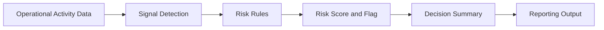

# Operational Risk & Decision Intelligence System

An operational risk and decision-support framework that turns routine activity signals into explainable risk scores, flags, and review-ready summaries.

Operational teams generate signals every day through statuses, due dates, handoffs, priority levels, and rework. This framework shows how those scattered signals can be combined into a structured review process so emerging risk is easier to spot, explain, and discuss.

## Project Summary

The project defines a Phase 1 framework for reviewing operational work before small issues become larger delivery, quality, or ownership problems. It organizes common activity signals into a rule-based scoring model, assigns a review classification, and outlines how results can be summarized for leadership or operations review.

The focus is practical decision support: making operational risk visible enough for teams to prioritize review, ask better questions, and document why an item needs attention.

## Problem It Solves

Operational risk often builds gradually. An overdue item, a priority label, a handoff, or a rework event may not mean much on its own. When those signals appear together, they can point to process friction, unclear ownership, delivery delay, or quality risk.

Without a consistent review model, teams may rely on manual scanning, backlog totals, or status labels that do not show which items need closer attention.

## How the Framework Helps

- Converts routine operational activity into consistent risk indicators
- Helps prioritize review around items with stronger warning signals
- Shows why an item was classified as stable, watch, or at risk
- Supports clearer escalation and process-improvement discussions
- Maintains a connection between source signals, scoring rules, and outputs

## How It Works


```mermaid
flowchart LR
    A["Operational Activity Data"] --> B["Signal Detection"]
    B --> C["Risk Rules"]
    C --> D["Risk Score and Flag"]
    D --> E["Decision Summary"]
    E --> F["Reporting Output"]
```

1. Operational activity data is organized for review.
2. Key signals are identified, including overdue days, priority, handoffs, and rework.
3. Business rules convert those signals into a risk score.
4. Thresholds classify each item as stable, watch, or at risk.
5. Results are summarized for review and reporting.

## Risk Scoring Logic

The scoring model uses transparent business rules rather than predictive modeling. Each operational item is scored using overdue days, handoff count, priority weight, and rework count.

```text
Risk Score =
(Overdue Days x 0.4)
+ (Number of Handoffs x 0.3)
+ (Priority Weight x 0.2)
+ (Rework Count x 0.1)
```

The current review thresholds are:

| Score | Classification | Review Meaning |
| ---: | --- | --- |
| 0-30 | Stable | No immediate risk signal based on the current rules |
| 31-60 | Watch | Review is recommended |
| 61+ | At Risk | Escalation or closer follow-up may be needed |

The weights and thresholds are Phase 1 examples and should be calibrated to the operating context and available data before real-world use.

See [logic/risk_scoring.md](logic/risk_scoring.md) for the detailed model and intended-use guidance.

## Example Walkthrough

This example shows how routine operational signals move through the framework and become a review classification.

### Sample Operational Input

| Item ID | Status | Priority Weight | Overdue Days | Handoff Count | Rework Count |
| --- | --- | ---: | ---: | ---: | ---: |
| OPS-1042 | In Review | 50 | 120 | 8 | 6 |
| OPS-1087 | Open | 50 | 60 | 8 | 8 |
| OPS-1110 | In Progress | 20 | 20 | 1 | 0 |

### Example Risk Output

| Item ID | Risk Score | Flag | Explanation | Suggested Review |
| --- | ---: | --- | --- | --- |
| OPS-1042 | 61 | At Risk | Significantly overdue with elevated priority, multiple handoffs, and rework | Confirm ownership, identify the blocker, and determine whether escalation is needed |
| OPS-1087 | 37 | Watch | Moderate overdue, handoff, and rework signals | Confirm ownership and monitor during the next review |
| OPS-1110 | 12 | Stable | Current signals do not indicate immediate review risk | Continue normal tracking |

### Why OPS-1042 Was Flagged

OPS-1042 is classified as at risk because several warning signals are present at the same time. It is significantly overdue, carries elevated priority, has passed through multiple handoffs, and includes rework. That combination suggests the item may need ownership clarification, blocker review, or escalation before the issue becomes harder to recover.

## Repository Structure

```text
.
+-- analysis/      # Analysis scope, review summaries, trend concepts, and calibration planning
+-- data/          # Raw and validated operational data organization
+-- governance/    # Assumptions, limitations, exclusions, and failure modes
+-- logic/         # Risk-scoring model and intended-use guidance
+-- reporting/     # Decision briefs and leadership review-summary concepts
+-- README.md      # Public project overview
```

Supporting documentation:

- [analysis/README.md](analysis/README.md)
- [data/README.md](data/README.md)
- [governance/limitations.md](governance/limitations.md)
- [logic/risk_scoring.md](logic/risk_scoring.md)
- [reporting/README.md](reporting/README.md)

## Tech Stack

- Markdown for project and governance documentation
- Mermaid for process architecture
- Deterministic business rules for risk scoring
- Structured operational data and reporting examples

## Design Approach

The framework prioritizes transparent risk signals, traceable scoring logic, and human review. Each classification can be tied back to the operational signals and rules that produced it.

## Next Phase

The next phase will implement the scoring model using a small non-sensitive operational dataset, produce reusable risk-summary outputs, develop a simple dashboard-style review view, and explore threshold calibration using sample scenarios.

## Current Status

The Phase 1 risk framework, scoring logic, governance structure, and reporting flow are established. Development is continuing with implementation and reporting components planned for the next phase.
