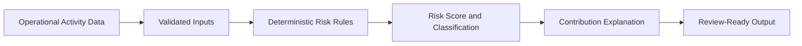

# Operational Risk & Decision Intelligence System

An operational risk and decision-support system that turns routine activity signals into explainable risk scores, flags, and review-ready summaries.

The project shows how activity data from workflows, tickets, cases, and handoffs can be organized into a practical review framework for spotting early signs of operational risk.

## Project Summary

Operational teams generate activity data through tickets, cases, handoffs, status changes, due dates, and rework. The challenge is turning that activity into clear signals that help teams decide what needs review.

The project now includes an executable Phase 2 prototype built on the original Phase 1 framework. It applies deterministic business rules to validated operational inputs, preserves the weighted contribution of each signal, and produces structured outputs for human review.

## Problem It Solves

Operational issues often develop gradually across disconnected workflows. A single overdue task may not be concerning, but an overdue, high-priority item with repeated handoffs and rework may deserve closer attention.

The system is designed to help teams:

- Convert routine operational activity into consistent risk indicators
- Focus review time on items with stronger warning signals
- Show why an item was classified as stable, watch, or at risk
- Support escalation and process-improvement conversations
- Preserve traceability between inputs, rules, and outputs

## Why It Matters

Operational risk can remain hidden when teams rely only on status labels, backlog totals, or manual review. Combining several activity signals provides a clearer view of potential process friction, unclear ownership, delivery delay, and quality risk.

This project focuses on practical visibility rather than prediction. Its purpose is to make emerging risk easier to identify, communicate, and review before small problems grow into larger process issues.

## What It Does

The current prototype provides:

- A documented and executable deterministic risk-scoring model
- Stable, watch, and at-risk classifications
- Weighted contribution details for every scored signal
- Human-readable explanations derived directly from the scoring inputs
- A validated synthetic sample dataset for repeatable demonstrations
- A review pipeline that ranks higher-risk items and summarizes classification counts
- Automated regression tests for calculations, thresholds, validation, and determinism
- Governance assumptions, limitations, and intended-use guidance
- Separation of raw and validated data

## How It Works


```mermaid
flowchart LR
    A["Operational Activity Data"] --> B["Validated Inputs"]
    B --> C["Deterministic Risk Rules"]
    C --> D["Risk Score and Classification"]
    D --> E["Contribution Explanation"]
    E --> F["Review-Ready Output"]
```

1. Operational activity data is organized and validated for review.
2. Relevant signals are read, including overdue days, priority, handoffs, and rework.
3. Deterministic business rules convert those signals into a risk score.
4. Thresholds classify each item as stable, watch, or at risk.
5. Weighted contributions preserve an explanation trail for every score.
6. The analysis workflow summarizes classifications and ranks review candidates.

## Risk Scoring Logic

The documented scoring model is:

```text
Risk Score =
(Overdue Days x 0.4)
+ (Number of Handoffs x 0.3)
+ (Priority Weight x 0.2)
+ (Rework Count x 0.1)
```

The current review thresholds are:

| Score | Classification | Review Meaning |
| ---: | --- | --- |
| 0-30 | Stable | No immediate risk signal based on the current rules |
| 31-60 | Watch | Review is recommended |
| 61+ | At Risk | Escalation or closer follow-up may be needed |

The weights and thresholds remain illustrative. They would need to be calibrated to the operating context and available data before real-world use.

See [logic/risk_scoring.md](logic/risk_scoring.md) for the detailed model and intended-use guidance. The executable implementation is in [logic/risk_score.py](logic/risk_score.py).

## Example Walkthrough

The following example shows how three fictional operational items are evaluated during a review.

### Sample Operational Input

| Item ID | Status | Priority Weight | Overdue Days | Handoff Count | Rework Count |
| --- | --- | ---: | ---: | ---: | ---: |
| OPS-1042 | In Review | 50 | 120 | 8 | 6 |
| OPS-1087 | Open | 50 | 60 | 8 | 8 |
| OPS-1110 | In Progress | 20 | 20 | 1 | 0 |

### Example Risk Output

| Item ID | Risk Score | Flag | Suggested Review |
| --- | ---: | --- | --- |
| OPS-1042 | 61.0 | At Risk | Confirm ownership, identify the blocker, and determine whether escalation is needed |
| OPS-1087 | 37.2 | Watch | Confirm ownership and monitor during the next review |
| OPS-1110 | 12.3 | Stable | Continue normal tracking |

### Why OPS-1042 Was Flagged

OPS-1042 crosses the at-risk threshold because its weighted signals total 61.0 points:

- Overdue days: 48.0
- Ownership handoffs: 2.4
- Priority weight: 10.0
- Rework: 0.6

The flag does not mean the item has failed. It indicates that the item should receive review. The implementation preserves these signal contributions so a reviewer can trace the classification back to its inputs.

## Run the Phase 2 Prototype

The prototype uses only the Python standard library.

From the repository root:

```bash
python -m analysis.run_risk_review
```

To return only the top three review candidates:

```bash
python -m analysis.run_risk_review --top 3
```

To write the structured review output to JSON:

```bash
python -m analysis.run_risk_review --output reporting/risk_review.json
```

Run the automated tests with:

```bash
python -m unittest discover -s tests -v
```

## Repository Structure

```text
.
+-- analysis/
|   +-- run_risk_review.py               # Executable evaluation and review-summary workflow
+-- data/
|   +-- validated/
|       +-- sample_operational_items.csv # Synthetic validated demonstration data
+-- governance/                          # Assumptions, limitations, exclusions, and failure modes
+-- logic/
|   +-- risk_scoring.md                  # Documented scoring model and intended use
|   +-- risk_score.py                    # Deterministic scoring and explanation engine
+-- reporting/                           # Review-summary and decision-brief concepts
+-- tests/
|   +-- test_risk_score.py               # Regression and boundary tests
+-- README.md
```

## Tech Stack

- Python 3 standard library
- CSV for validated sample inputs
- JSON for structured review output
- `unittest` for automated decision-logic tests
- Mermaid for process architecture
- Markdown for project and governance documentation
- Deterministic business rules for risk scoring

## Design Approach

The system prioritizes explainable risk signals, traceable scoring logic, reproducibility, and human review. Each classification can be traced back to the operational signals and weighted contributions that produced it.

The implementation intentionally avoids predictive modeling, automated enforcement, and unsupported business rules. Concepts that are not mathematically specified in the Phase 1 documentation are not silently invented in code.

## Data and Privacy

The included sample dataset is synthetic and fictional. It is provided only to demonstrate the scoring and review workflow and does not represent data from an employer, customer, Salesforce environment, or other real operational system.

## Next Phase

The next phase can expand the reporting layer with reusable decision briefs and a dashboard-style review view, then introduce explicit calibration experiments for weights and thresholds without changing the current model silently.

## Current Status

Phase 2 now includes an executable deterministic scoring engine, validated synthetic sample data, a review-summary workflow, weighted explanation trails, and automated tests. The system remains a prototype intended for decision support and portfolio demonstration rather than production deployment.
