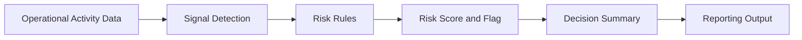

# Operational Risk & Decision Intelligence System

An operational risk and decision-support framework that turns routine activity signals into explainable risk scores, flags, and review-ready summaries.

Operational teams already generate signals through overdue work, priority levels, repeated handoffs, and rework. Those signals are often reviewed separately, making operational risk harder to discuss with consistent supporting context.

## Operational Problem

Status labels and backlog counts rarely tell the full story. A single overdue item may be manageable, but an overdue high-priority item with multiple handoffs and rework can point to a deeper process issue.

The review model brings those signals together so operational risk can be evaluated consistently and discussed with clear supporting context.

## Review Framework

| Layer | Includes | Output |
| --- | --- | --- |
| Inputs | Overdue days, priority weight, handoff count, rework count | Structured operational signals |
| Processing | Defined risk rules, weighted scoring, classification thresholds | Risk score and stable/watch/at-risk flag |
| Review output | Explanation and suggested review action | Summary for operational or leadership review |

Implemented now:

- Python scoring engine in [logic/risk_score.py](logic/risk_score.py)
- Operational readiness policy and decision engine in [logic/readiness_gate.py](logic/readiness_gate.py)
- Synthetic validated sample data in [data/validated/sample_operational_items.csv](data/validated/sample_operational_items.csv)
- Executable evaluation workflow in [analysis/evaluate_operational_risk.py](analysis/evaluate_operational_risk.py)
- Threshold sensitivity workflow in [analysis/analyze_threshold_sensitivity.py](analysis/analyze_threshold_sensitivity.py)
- Dashboard-style review report in [analysis/build_operational_review_dashboard.py](analysis/build_operational_review_dashboard.py)
- Operational readiness workflow in [analysis/evaluate_operational_readiness.py](analysis/evaluate_operational_readiness.py)
- Generated review summary in [reporting/risk_review_summary.md](reporting/risk_review_summary.md)
- Generated operational review dashboard in [reporting/operational_review_dashboard.md](reporting/operational_review_dashboard.md)
- Generated readiness assurance summary in [reporting/operational_readiness_summary.md](reporting/operational_readiness_summary.md)
- Automated regression tests in [tests/](tests/) for scoring, validation, threshold sensitivity, dashboard behavior, and generated-report consistency

## How It Works


```mermaid
graph LR;
    A[Operational Activity Data] --> B[Signal Detection];
    B --> C[Risk Rules];
    C --> D[Risk Score and Flag];
    D --> E[Decision Summary];
    E --> F[Reporting Output];
```

1. Operational activity data is organized for review.
2. Overdue days, priority, handoffs, and rework are identified as review signals.
3. Business rules convert those signals into a weighted risk score.
4. The review score is rounded consistently and thresholds classify each item as stable, watch, or at risk.
5. Results are summarized for reporting and follow-up discussion.

## Risk Scoring Logic

Each item is scored using the same weighted formula:

```text
Risk Score =
(Overdue Days x 0.4)
+ (Number of Handoffs x 0.3)
+ (Priority Weight x 0.2)
+ (Rework Count x 0.1)
```

The current review thresholds are:

| Score | Classification | Review Meaning |
| ---: | --- | --- |
| 0-30 | Stable | No immediate risk signal based on the current rules |
| 31-60 | Watch | Review is recommended |
| 61+ | At Risk | Escalation or closer follow-up may be needed |

Review outputs use whole-number scores with conventional half-up rounding. The exact weighted calculation remains available in the scoring engine for audit and regression testing.

The weights and thresholds are illustrative examples and should be reviewed against the operating context and available data before real-world use.

See [logic/risk_scoring.md](logic/risk_scoring.md) for the detailed scoring logic and intended-use guidance.

## Run the Evaluation

From the repository root:

```text
python -m unittest discover -s tests
python analysis/evaluate_operational_risk.py
python analysis/analyze_threshold_sensitivity.py
python analysis/build_operational_review_dashboard.py
python analysis/evaluate_operational_readiness.py
```

The analysis workflows read synthetic validated sample data, evaluate operational risk signals, test illustrative threshold scenarios, evaluate modeled readiness controls, and write review outputs in the reporting directory.

## Two Decision Layers

The repository now separates two related but different review questions:

| Layer | Question Answered | Main Output |
| --- | --- | --- |
| Operational risk | What deserves attention? | Risk score, flag, and review queue |
| Operational readiness | What required evidence or controls remain unresolved? | Readiness decision, unresolved controls, and decision trace |

A high-risk item is not automatically unready, and a low-risk item may still lack required readiness evidence. Keeping the models separate prevents one signal from substituting for another.

```text
Operational Activity
        |
Deterministic Risk Evaluation
        |
Review Prioritization

Readiness Policy
      +
Initiative Inventory
      +
Evidence Assessments
        |
Validation
        |
Deterministic Readiness Decision
        |
Decision Trace
        |
Human Review
```

## Example Walkthrough

During an operational review, three items are evaluated using the same activity signals and scoring rules.

### Sample Operational Input

| Item ID | Status | Priority Weight | Overdue Days | Handoff Count | Rework Count |
| --- | --- | ---: | ---: | ---: | ---: |
| OPS-1042 | In Review | 50 | 120 | 8 | 6 |
| OPS-1087 | Open | 50 | 60 | 8 | 8 |
| OPS-1110 | In Progress | 20 | 20 | 1 | 0 |

### Example Risk Output

| Item ID | Risk Score | Flag | Explanation | Suggested Review |
| --- | ---: | --- | --- | --- |
| OPS-1042 | 61 | At Risk | Significantly overdue with elevated priority, multiple handoffs, and rework | Confirm ownership, identify the blocker, and determine whether escalation is needed |
| OPS-1087 | 37 | Watch | Moderate overdue, handoff, and rework signals | Confirm ownership and monitor during the next review |
| OPS-1110 | 12 | Stable | Current signals do not indicate immediate review risk | Continue normal tracking |

### OPS-1042 Review Note

OPS-1042 is classified as At Risk with a score of 61. The item is 120 days overdue, carries elevated priority, and has accumulated eight handoffs and six instances of rework. Together, those signals suggest an ownership or process issue that warrants review.

The full sample run evaluates eight fictional operational items and produces this distribution:

| Classification | Count |
| --- | ---: |
| At Risk | 1 |
| Watch | 3 |
| Stable | 4 |

## Repository Structure

```text
.
+-- analysis/      # Risk, threshold, dashboard, and readiness workflows
+-- data/          # Fictional validated operational and readiness data
+-- governance/    # Assumptions, limitations, exclusions, and failure modes
+-- logic/         # Risk scoring and readiness decision rules
+-- reporting/     # Generated review summaries, dashboard outputs, and readiness summaries
+-- tests/         # Regression tests for scoring, readiness, validation, reports, and workflows
+-- README.md      # Public project overview
```

Supporting documentation:

- [analysis/README.md](analysis/README.md)
- [data/README.md](data/README.md)
- [governance/limitations.md](governance/limitations.md)
- [governance/readiness_assurance.md](governance/readiness_assurance.md)
- [logic/risk_scoring.md](logic/risk_scoring.md)
- [reporting/README.md](reporting/README.md)

## Design Approach

The framework prioritizes transparent risk signals, traceable scoring logic, and human review. Each classification can be tied back to the operational signals and rules that produced it.

## Validation And Reproducibility

Continuous integration runs on Python 3.11 and 3.12. Generated reports are committed artifacts, and CI verifies that running the report generators does not leave protected reporting outputs stale.

## Readiness Boundaries

Operational Readiness Assurance uses an explicit policy, initiative inventory, PASS / FAIL / UNKNOWN assessment states, CURRENT / STALE / MISSING evidence states, missing-assessment handling, and deterministic decision traces.

READY means the modeled controls satisfy the current policy snapshot. It does not authorize deployment, certify compliance, guarantee success, or replace human organizational judgment.

## Next Feature

The next substantial planned feature is readiness-state history and control closure tracking so changes in unresolved controls can be reviewed across snapshots without changing the current deterministic decision rules.
